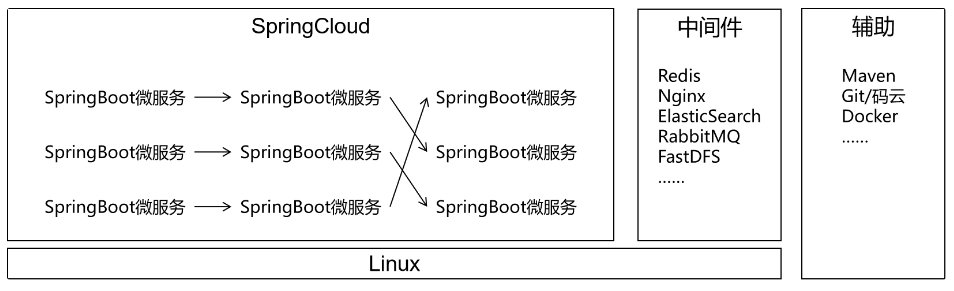
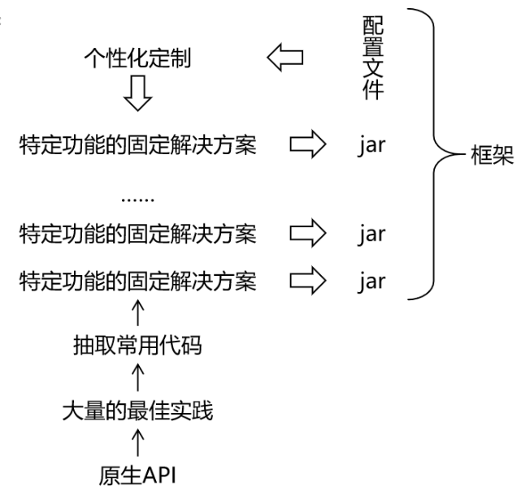

[toc]

# Spring

>  本笔记基于[尚硅谷讲解视频](https://www.bilibili.com/video/BV1AP411s7D7/?spm_id_from=333.337.search-card.all.click&vd_source=31d39c465d959f9ebfb4e20fc1ca0a9d)作了一定修改。
>
> 原笔记链接请访问：[wolai链接](https://www.wolai.com/oacbJpH1wPzGNoMAVnoELR)。感谢atguigu提供的优秀教程及笔记。

TODOS：

- [ ] 

| 核心点              | 掌握目标                                           |
| ------------------- | -------------------------------------------------- |
| spring框架理解      | spring家族和spring framework框架                   |
| spring核心功能      | ioc/di , aop , tx                                  |
| **spring ioc / di** | **组件管理、ioc容器、ioc/di , 三种配置方式**       |
| spring aop          | aop和aop框架和代理技术、基于注解的aop配置          |
| spring tx           | 声明式和编程式事务、动态事务管理器、事务注解、属性 |

## 一、技术体系结构

### 1.1 总体技术体系

- 单一架构

    一个项目，一个工程，导出为一个war包，在一个Tomcat上运行。也叫all in one。

    

    单一架构，项目主要应用技术框架为：Spring , SpringMVC , Mybatis
- 分布式架构

    一个项目（对应 IDEA 中的一个 project），拆分成很多个模块，每个模块对应 IDEA 中的一个 module。每一个工程都是运行在自己的 Tomcat 上。模块之间可以互相调用。每一个模块内部可以看成是一个单一架构的应用。

    

    分布式架构，项目主要应用技术框架：SpringBoot (SSM), SpringCloud , 中间件等

### 1.2 框架概念和理解

框架( Framework )是一个集成了基本结构、规范、设计模式、编程语言和程序库等基础组件的软件系统，它可以用来构建更高级别的应用程序。框架的设计和实现旨在解决特定领域中的常见问题，帮助开发人员更高效、更稳定地实现软件开发目标。

框架的优点包括以下几点：

1. 提高开发效率：框架提供了许多预先设计好了的组件和工具，能够帮助开发人员快速进行开发。相较于传统手写代码，在框架提供的规范化环境中，开发者可以更快地实现项目的各种要求。
2. 降低开发成本：框架的提供标准化的编程语言、数据操作等代码片段，避免了重复开发的问题，降低了开发成本，提供深度优化的系统，降低了维护成本，增强了系统的可靠性。
3. 提高应用程序的稳定性：框架通常经过了很长时间的开发和测试，其中的许多组件、代码片段和设计模式都得到了验证。重复利用这些组件有助于减少bug的出现，从而提高了应用程序的稳定性。
4. 提供标准化的解决方案：框架通常是针对某个特定领域的，通过提供标准化的解决方案，可以为开发人员提供一种共同的语言和思想基础，有助于更好地沟通和协作。

框架的缺点包括以下几个方面：

1. 学习成本高：框架通常具有特定的语言和编程范式。对于开发人员而言，需要花费时间学习其背后的架构、模式和逻辑，这对于新手而言可能会耗费较长时间。
2. 可能存在局限性：虽然框架提高了开发效率并可以帮助开发人员解决常见问题，但是在某些情况下，特定的应用需求可能超出框架的范围，从而导致应用程序无法满足要求。开发人员可能需要更多的控制权和自由度，同时需要在框架和应用程序之间进行权衡取舍。
3. 版本变更和兼容性问题：框架的版本发布和迭代通常会导致代码库的大规模变更，进而导致应用程序出现兼容性问题和漏洞。当框架变更时，需要考虑框架是否向下兼容，以及如何进行适当的测试、迁移和升级。
4. 架构风险：框架涉及到很多抽象和概念，如果开发者没有足够的理解和掌握其架构，可能会导致系统出现设计和架构缺陷，从而影响系统的健康性和安全性。

站在文件结构的角度理解框架，可以将框架总结：**框架 = jar包+配置文件**

莎士比亚说,"一千个观众眼中有一千个哈姆雷特" 即仁者见仁,智者见智.说每个人都会对作品有不同的理解，每个人对待任何事物都有自己的看法，同样的技术解决同样的问题会产生不同流程和风格的解决方案，而采用一种框架其实就是限制用户必须使用其规定的方案来实现，可以降低程序员之间沟通以及日后维护的成本！

常用的单一架构JavaEE项目框架演进，从SSH、SSH2过渡到了SSM：SpringMVC、Spring、MyBatis。

总之，框架已经对基础的代码进行了封装并提供相应的API，开发者在使用框架是直接调用封装好的API可以省去很多代码编写，从而提高工作效率和开发速度。

## 二、SpringFramework介绍

### 2.1 Spring和SpringFramework概念

[Spring官网](https://spring.io/)

- **广义的 Spring：Spring 技术栈**（全家桶）

  广义上的 Spring 泛指以 Spring Framework 为基础的 Spring 技术栈。

  经过十多年的发展，Spring 已经不再是一个单纯的应用框架，而是逐渐发展成为一个由多个不同子项目（模块）组成的成熟技术，例如 Spring Framework、Spring MVC、SpringBoot、Spring Cloud、Spring Data、Spring Security 等，其中 Spring Framework 是其他子项目的基础。

  这些子项目涵盖了从企业级应用开发到云计算等各方面的内容，能够帮助开发人员解决软件发展过程中不断产生的各种实际问题，给开发人员带来了更好的开发体验。

- **狭义的 Spring：Spring Framework**（基础框架）

  狭义的 Spring 特指 Spring Framework，通常我们将它称为 Spring 框架。

  Spring Framework（Spring框架）是一个开源的应用程序框架，由SpringSource公司开发，最初是为了解决企业级开发中各种常见问题而创建的。它提供了很多功能，例如：依赖注入（Dependency Injection）、面向切面编程（AOP）、声明式事务管理（TX）等。其主要目标是使企业级应用程序的开发变得更加简单和快速，并且Spring框架被广泛应用于Java企业开发领域。

  Spring全家桶的其他框架都是以SpringFramework框架为基础！

- **对比理解：**

  QQ 和 腾讯

  腾讯 = Spring

  QQ = SpringFramework

## Spring框架理解以及一些关键概念

1. Spring是什么？（框架=.jar+文档(可配置的，可自定义配置文件的)）
   - 同时还要分清楚俗话讲地Spring是指什么？可以指广义地指这个框架大家族，也可以狭义的指Spring Framework这个框架……
2. Ioc是什么？控制反转（通俗讲就是把创建一个类、实例化的权力交给了Spring中的容器来管理）
3. Di是什么？依赖注入（emm……大概是给某个类中的某个对象赋值（有参构造的的参数赋值过程也是di、setter方法也是di）【肯定有表达不准确的地方】）
4. bean是什么？（翻译：组件）

## Spring框架配置方案

1. Spring中有一些接口和实现类
   - Bean...
   - ApplicationContext
   - ClassPathXmlApplicationContext、FileSystemXmlApplicationContext、WebApplicationContext、?

2. 在以.xml格式配置的方案中，里面内容怎么写？（先是如何快速创建这样一个.xml文件）
   - 要创建一个组件，就写一个<bean id="" class= "".../>
   - 当然分组件类型的：
     1. 默认构建<bean id="" class=""/>即可
     2. 静态工厂构造
     3. 非静态工厂构造
     4. 有参数构造（涉及到di了）（ps：上述三种还只是创建ioc容器）

## 如何获取（容器中的）Bean

1. 第一种
2. 第二种
3. 第三种

> 刚学过就不立马回忆了……

## 三层架构（以及其他旧内容）

1. controller
2. service
3. dao

> JdbcTemplate需要Druid连接池，Druid连接池需配置4个信息（驱动、url、用户名、密码）

## Spring-IoC/Di 概念+实践

概念：见上

实践：

1. XML配置：

   - 写在.xml文件内，主要写<bean id="" class=""
   - 如要注入属性信息，在<bean> </bean>中间加入<properties name="" value/ref二选一
   - 如要引入外部配置文件（e.g. jdbc.properties）使用命名空间<context:property-placeholder
   - 此时IoC容器选择ClassPathXmlApplicationContext

2. 注解方式配置：

   - 使用注解如——@Component、@Service、@Controller、@Repository以标记Ioc
   - 使用注解如——@Autowired、@Qualifier、@Resource、@Value标记di
   - 此时IoC容器选择ClassPathXmlApplicationContext
   - ps：第三方类需使用xml或者配置类方式（不能写上述注解解决）

3. 配置类方式配置：

   - 配置类是指有@Configuration标注的类
   - 标记IoC注解：@Component,@Service,@Controller,@Repository 
   2. 标记DI注解：@Autowired @Qualifier @Resource @Value
   3. <context:component-scan标签指定注解范围使用@ComponentScan(basePackages = {"com.atguigu.components"})替代
   4. <context:property-placeholder引入外部配置文件使用@PropertySource({"classpath:application.properties","classpath:jdbc.properties"})替代
   5. <bean 标签使用@Bean注解和方法实现

   - 此时IoC容器选择AnnotationConfigApplicationContext

## Spring-AOP

- AOP：概念理解——面向切面编程
  - 切面 = 切点 + ？
  - 底层使用技术：cglib、？（前者产生一个代理类，是目标类的子类；后者在ioc容器中产生的类对象，是与目标类实现了同一个接口的）
    - 因此总结：前者调用ioc容器获取bean对象时，需要使用目标类本身来接收这个bean对象；后者调用ioc容器获取bean对象时，只能使用这个接口lai'jie'sho

## Spring-Tx

声明式事务

